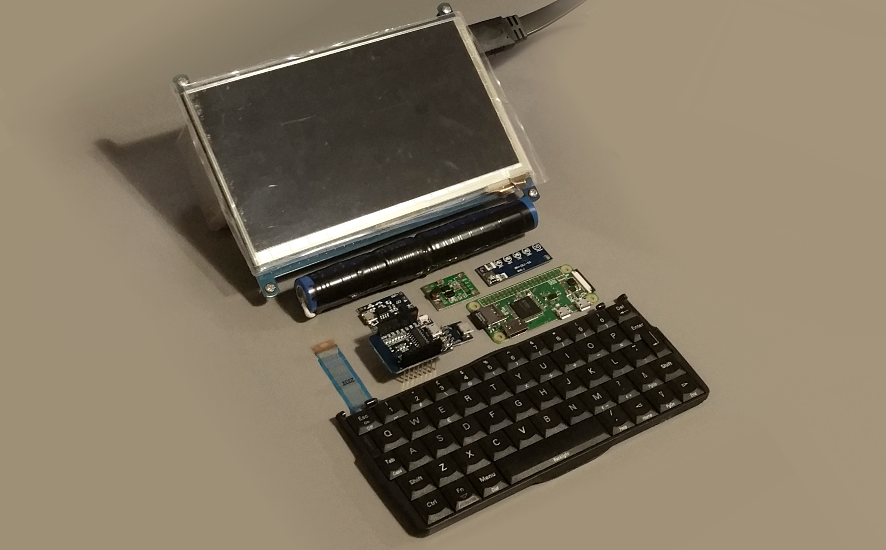
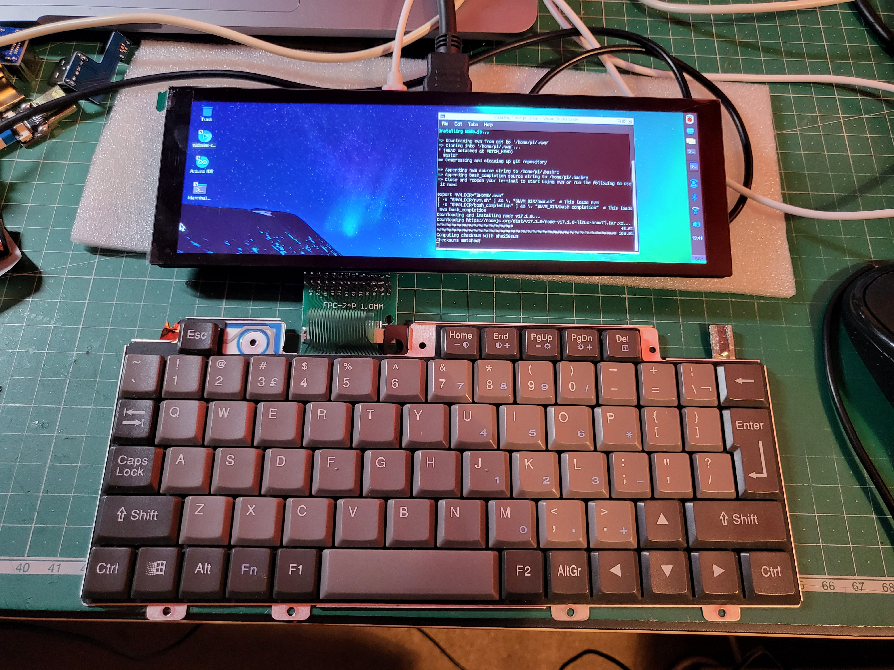
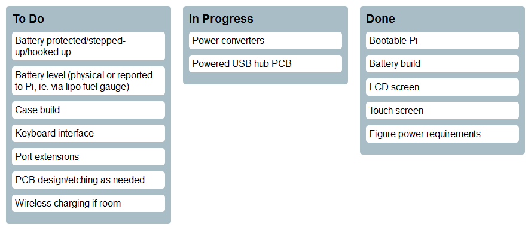

# Psion Pi

Personal electronics project; Attempting to build a modern PDA clamshell computer in a likeness of the venerable Psion 5mx.



4 years into this project, some significant changes, namely wide screen, HP Jornada keyboard and Pi Zero 2 W (significantly more capable.. the previous Zero put me off)





<!---KANBAN
# To Do
- Battery protected/stepped-up/hooked up
- Battery level (physical or reported to Pi, ie. via lipo fuel gauge)
- Case build
- Keyboard interface
- Port extensions
- PCB design/etching as needed
- Wireless charging if room

# In Progress
- Power converters
- Powered USB hub PCB

# Done
- Bootable Pi
- Battery build
- LCD screen
- Touch screen
- Figure power requirements
KANBAN--->

## Aims

- Tasty colour screen - For enjoyable video playback.
- Quality keyboard - So it's legitimately useful.
- Portability - I'm under no illusions that it'll be larger than a Psion 5mx/Jornada (as would be ideal) because of screen size and battery demands but if it's smaller than a Netbook Pro I'll be happy.
- Sturdiness - Every single bit will be inherently fragile as heck, so I need to 3D print the structure real good.

## Ingredients

- Battery pack (18650 2S parallel 3.7v) - Home-made li-ion for the win!
- Charging circuity and steps ups with protection - So I don't blow myself up.
- Raspberry Pi Zero W (1.1)
- Psion 5mx keyboard - What? No way! Yes way. **Yes frickin way**.
- Keyboard USB interface - Arduino or ESP8266, hand-built.
- 7" Capacitive Touchscreen LCD 1024\*600 (Waveshare C Rev2.1)
- Mad efficient 1337 OS and warez, legit IDE, etc - We'll start with vanilla Raspbian first though.

## "Wait, so what's this repo even for then?"

Notes about how I set everything up for reference, config files, microcontroller code for keyboard interface, etc etc.

## Setting up the Pi

I had more problems with the Zero W than any other Pi, even sent one back. Probably just batch teething problems but anyway..

Raspbian Stretch (2017-08-16) did **not** work, no matter what.

Raspbian Jessie (2017-07-05) did though, [available here](https://downloads.raspberrypi.org/raspbian/images/raspbian-2017-07-05/)

Installed on a 16gb Kingston microSD with win32diskImager (or similar) then, _before removing_, (in the windows partition, or `/boot` on unix):

1. Create a blank file called `ssh` on it, e.g.

```bash
cd /d h:
echo > ssh
```

2. Create `wpa_supplicant.conf` containing:

```bash
country=US
ctrl_interface=DIR=/var/run/wpa_supplicant GROUP=netdev
update_config=1

network={
 ssid="NetworkName"
 scan_ssid=1
 psk="yourpassword"
 key_mgmt=WPA-PSK
}
```

3. Safely eject (they can become corrupt, trust)
4. Pop it in the Pi with HDMI and a keyboard; let it do its thing.

Any screen problems and it should still be SSH-able.

## LCD Screen - 7.9" Waveshare Widescreen 400×1280

### `config.txt` append:

```bash
# Add support for 7.9" Waveshare LCD
max_usb_current=1
hdmi_group=2
hdmi_mode=87
hdmi_timings=400 0 100 10 140 1280 10 20 20 2 0 0 0 60 0 43000000 3
```

### Rotate

DO NOT DO THIS:
`config.txt` comment line and add, a la:

```bash
# disable advanced graphics just for termianl rotation, NOPE
#dtoverlay=vc4-kms-v3d
display_rotate=3 # 1: 90°; 2: 180°C; 3: 270°
```

This is essentially disabling advanced graphics on the Pi, which is necessary to rotate the headless terminal (only!).

I'll probs use it exclusively in desktop mode, so...

```bash
sudo nano /usr/share/X11/xorg.conf.d/99-fbturbo.conf
```

Comment out the line, a la:

```
#       Driver          "fbturbo"
```

Note: `display_rotate` will not work after this point so you have to set orientation (left) in raspbian preferences.

## Touch Setup

```bash
sudo apt-get install xserver-xorg-input-libinput
sudo mkdir /etc/X11/xorg.conf.d
sudo cp /usr/share/X11/xorg.conf.d/40-libinput.conf /etc/X11/xorg.conf.d/
sudo nano /etc/X11/xorg.conf.d/40-libinput.conf
```

Find the touchscreen section and add _one of_ the following lines, a la:

```bash
Section "InputClass"
        Identifier "libinput touchscreen catchall"
        MatchIsTouchscreen "on"
        # Option "CalibrationMatrix" "0 1 0 -1 0 1 0 0 1" # mykemod
        # Option "CalibrationMatrix" "0 1 0 -1 0 1 0 0 1" # mykemod 90 deg
        # Option "CalibrationMatrix" "-1 0 1 0 -1 1 0 0 1" # mykemod 180 deg
        Option "CalibrationMatrix" "0 -1 1 1 0 0 0 0 1" # mykemod 270 deg
        MatchDevicePath "/dev/input/event*"
        Driver "libinput"
EndSection
```

Note: It's also orientated by long-pressing the 'rotate touch' button on the screen so not sure how necessary this is.

## Brightness

Powers happily from the touch USB input \*\*\*\*
5 Settings, long press on/off on screen:
1 0.15A
2 0.16A
3 0.17A
4 0.19A
5 0.2A

## Overclock

Make sure to use a heat sink! A fan would let us go up to 1.4ghz

```bash
sudo nano /boot/config.txt
```

```
# Overclock 1.2ghz (all values typically unset)
arm_freq=1300 # 700 default
over_voltage=3
# Riskier, needs more POWAR
core_freq=515 # 500 default
gpu_freq=550 # 550 with heatsink, 530 without
```

## Other settings

Disable dimming, etc
https://www.waveshare.com/wiki/7.9inch_HDMI_LCD

## Power Usage

|                 Component | Usage (Amps +/- 0.05) |
| ------------------------: | --------------------- |
|                 Pi Zero W | 0.15 (unused)         |
|                      Pi 3 | 0.3 (idling)          |
|               Pi Zero 2 W | 0.3                   |
|                           |                       |
| Pi Zero 2 W (Overclocked) | 0.45                  |
|               7.9" Screen | 0.65                  |
|                     Total | 1.1                   |

Battery life estimates (conservative too!:
18650 x 1 (2500mah) = 2h 15m
18650 x 3 (7500mah) = 6h 45m

## Keyboard

Dell Axim X5 Foldable Keyboard - what a hero of a warlock of a battlemage of a keyboard!
Disassembling it revealed it only has three IO:

- 3.3V in
- GND
- Data out
  Hooking that all up to a USB FTDI (data => RX), reveals some useful output with the following settings (e.g. in RealTerm):
  Port -> Baud: 4800
  Display -> Display As: Hex

## Keymap

This wonderous diagram is courtesy of [Gavin Whelan](https://ambientmemory.com/), along with generally pointing me in the [right direction](https://ambientmemory.com/2017/02/20/dell-axim-x5-reverse-engineering/) to capture input.

    |------||------||------||------||------||------||------||------||------||------||------||-----||-----||--------|
    |  `~  ||  1!  ||  2@  ||  3#  ||  4$  ||  5%  ||  6^  ||  7&  ||  8*  ||  9(  ||  0)  || -_  ||  =+ ||  <-    |
    | 0ef1 || 16e9 || 1ee1 || 26d9 || 25da || 2ed1 || 36c9 || 3dc2 || 3ec1 || 46b9 || 45ba || 4e  ||  55 || 718e   |
    |      ||      ||      ||      ||      ||      ||      ||      ||      ||      ||      || b1  ||  aa ||        |
    |------||------||------||------||------||------||------||------||------||------||------||-----||-----||--------|
    |--------||------||------||------||------||------||------||------||------||------||------||-----||-----||------|
    |  ->|   ||  Q   ||  W   ||  E   ||  R   ||  T   ||  Y   ||  U   ||  I   ||  O   ||  P   || {   || }   ||  |\  |
    | 0df2   || 15ea || 1de2 || 24db || 2dd2 || 2cd3 || 35ca || 3cc3 || 43bc || 44bb || 4db2 || 54ab|| 5ba4|| 5da2 |
    |        ||      ||      ||      ||      ||      ||      ||      ||      ||      ||      || [   || ]   ||      |
    |--------||------||------||------||------||------||------||------||------||------||------||-----||-----||------|
    |----------||------||------||------||------||------||------||------||------||------||------||------||----------|
    |  caps    ||  A   ||  S   ||  D   ||  F   ||  G   ||  H   ||  J   ||  K   ||  L   ||  ;:  ||  '"  ||  enter   |
    | 58a7     || 1ce3 || 1be4 || 23dc || 2bd4 || 34cb || 33cc || 3bc4 || 42bd || 4bb4 || 4cb3 || 52ad || 5aa5     |
    |          ||      ||      ||      ||      ||      ||      ||      ||      ||      ||      ||      ||          |
    |----------||------||------||------||------||------||------||------||------||------||------||------||----------|
    |--------------||------||------||------||------||------||------||------||------||------||------||------||------|
    |  shift       ||  Z   ||  X   ||  C   ||  V   ||  B   ||  N   ||  M   ||  ,<  ||  .>  ||  /?  ||  ^   ||  rsh |
    | 12ed         || 1ae5 || 22dd || 21de || 2ad5 || 32cd || 31ce || 3ac5 || 41be || 49b6 || 4ab5 || 28d7 || 59a6 |
    |              ||      ||      ||      ||      ||      ||      ||      ||      ||      ||      ||  |   ||      |
    |--------------||------||------||------||------||------||------||------||------||------||------||------||------|
    |------||------||------||------||------------------------------||------||------||------||------||------||------|
    |  fn  || ctrl ||  win ||  ie  ||           space              || alt  || ctrl ||  del || <--  ||  |   ||  --> |
    | 02fd || 14eb || 07f8 || 708f ||           5ca3               || 11ee || 738c || 6699 || 5ea1 || 609f || 2fd0 |
    |      ||      ||      ||      ||                              ||      ||      ||      ||      ||  v   ||      |
    |------||------||------||------||------------------------------||------||------||------||------||------||------|

## OBSOLETE: Previous LCD screen attempts

### 7" Waveshare

Either copy the `config.txt` in this repo, or bosh this stuff into yours (in windows partition or `/boot` on unix):

```bash
# Add support for Waveshare 7" capacitive Touch (C) v2.1
# set current over USB to 1.2A
max_usb_current=1

# overscan to adjust image position
overscan_left=0
overscan_right=0
overscan_top=0
overscan_bottom=0

# HDMI config
hdmi_drive=1
hdmi_ignore_edid=0xa5000080
hdmi_group=2
hdmi_mode=87

# 1024x600 display
hdmi_cvt=1024 600 60 6 0 0 0
```

### 5" model A screen

Elegoo, a cheaper version of Wavershare model A (not B)

```bash
cd ~
wget https://github.com/entozoon/psion-pi/raw/master/lib/LCD-show-170703.tar.gz
tar xzvf *.tar.gz
rm *.tar.gz
cd LCD-show/
chmod +x LCD5-show
./LCD5-show
```

### 3.5"

Raspbian Stretch (2017-11-29)
